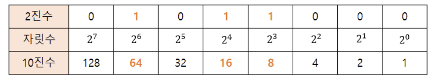
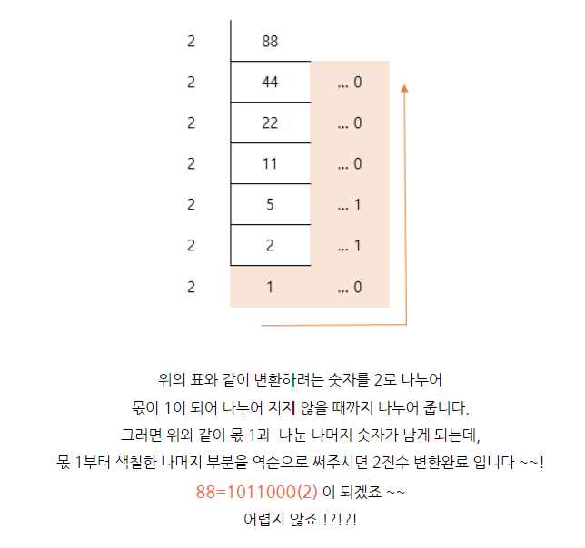
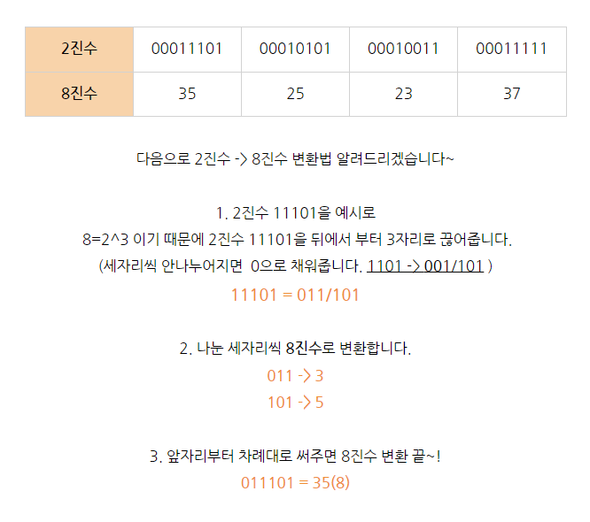
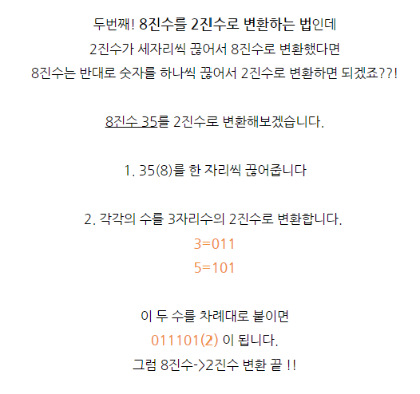
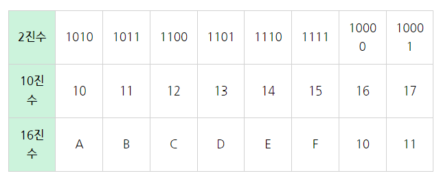
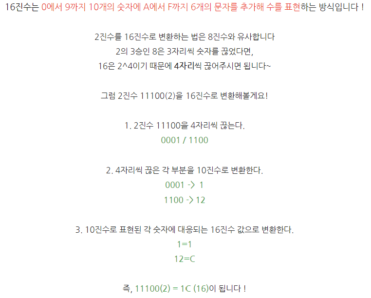
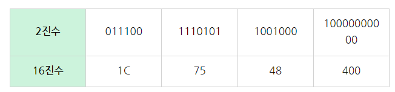
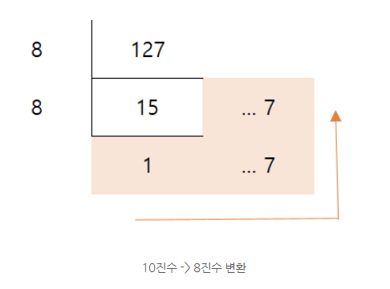
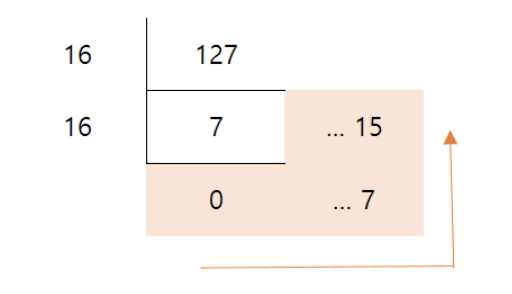
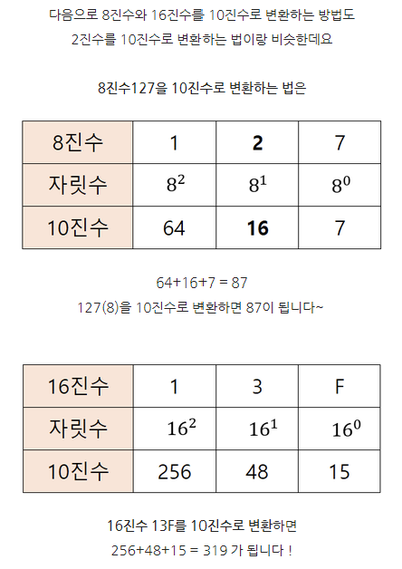

### 2진수 -> 10진수 변환

<table>
    <tr>
        <td>2진수</td>
        <td>00101010</td>
        <td>01110110</td>
        <td>01011000</td>
        <td>11100000</td>
    </tr>
    <tr>
        <td>10진수</td>
        <td>42</td>
        <td>118</td>
        <td>88</td>
        <td>224</td>
    </tr>
</table>

2진수를 10진수로 바꿔보자

이렇게 0과 1로 각 숫자 자릿수를 찍어주고 이것들을 다 더하면 된다.

64 + 16 + 8 = 88 이렇게 계산하란 것이다

 
 

### 10진수 -> 2진수 변환

라고 한다. 

 
 

### 2진수 -> 8진수 변환

자 2진수로 숫자를 표시하기엔 너무 길어지니까 8진수로 표현해보자

 
 

### 8진수 -> 2진수 변환

 
 

### 2진수 -> 16진수 변환

 
 

### 10진수 -> 8진수, 16진수

2진수와 마찬가지로 8로 계속 누어서 떨어질때까지 연산한다

 
 

### 8진수, 16진수 -> 10진수

### 참고 글 
> https://m.blog.naver.com/icbanq/221727893563